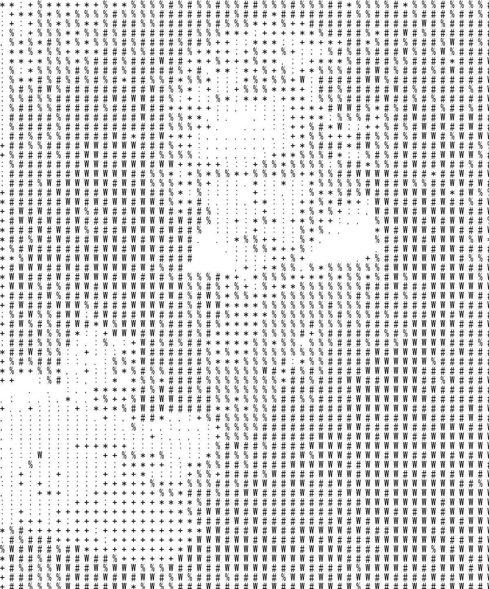
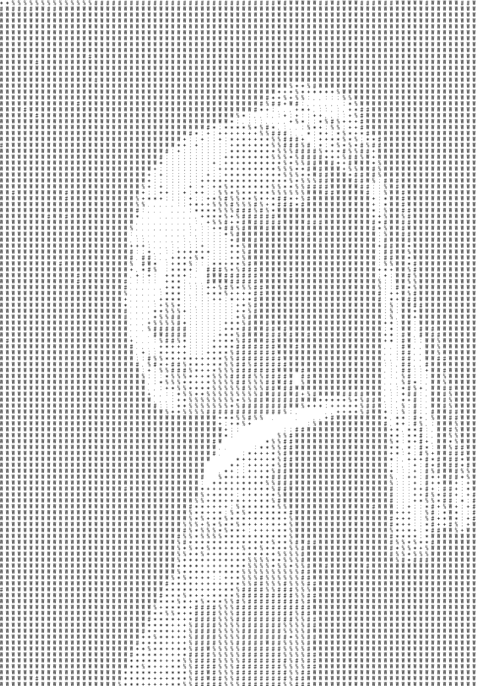
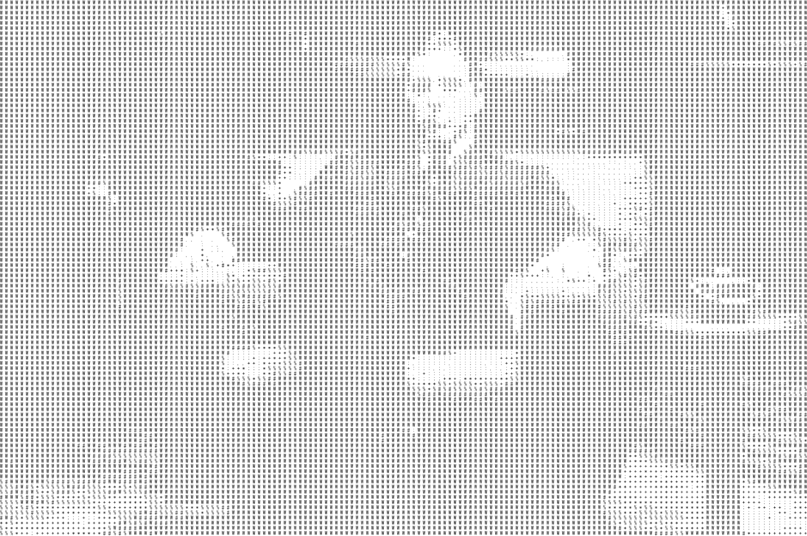
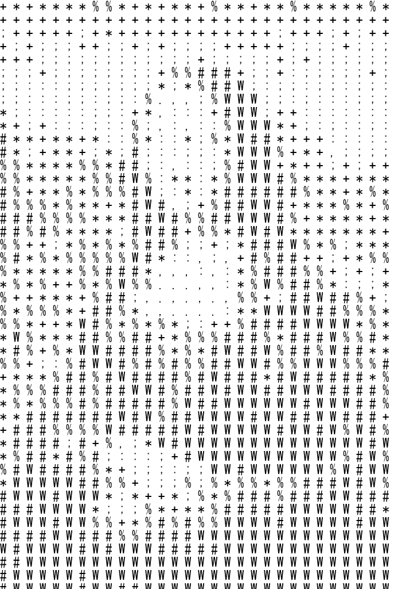
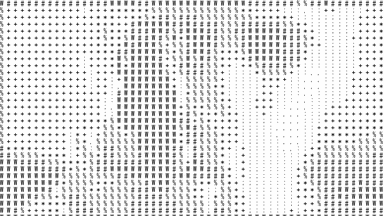
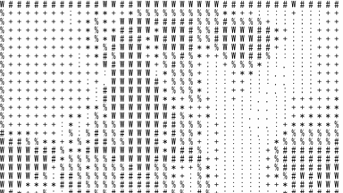
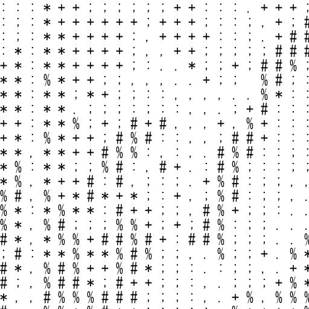

# 5. Create Ascii Art Applicaion

## What is an Ascii Art? {#what-is-an-ascii-art}
Ascii art is a graphic style composed of alphabets and symboles.














## 5.2 Load Image {##load-image}
You use Python Image Library. If you installed Python with Anaconda, it alredy installed the library, otherwise execute ```pip install Pillow```.
We use the sample input image ```Lenna.png``` . Locate the image in the same folder as .py file.

First, You write very simple code. you load an image, print its size and show the image.

```py
from PIL import Image
img = Image.open('Lenna.png')
print(img.size)
img.show()
```

(512, 512)


## 5.3 Convert into Grayscale {#convert-into-grayscale}
Each pixel is defined by the value of red, green and blue, (r, g, b), 0 <= r <= 255, 0<= g <= 255, 0 <= b <= 255. (r, g, b) is converted into the intensity (or Brightness) by
```
gray = red * 0.2126 + green * 0.7152 + b * 0.0722
```

You can see pixel data by load()

```py
from PIL import Image
img = Image.open('Lenna.png')
pixels = img.load()
print(pixels)
```

Bunch of (r, g, b) is shown now. Each pixel is accessed by ```pixels[x,y], 0 <= x < width, 0 <= y < height```. xy Coordination in a image is below.

O---------> x  
|  
|  
|   Image  
|  
|/  
y

convert them into grayscale because we are making grayscale ascii art.
```py
from PIL import Image
img = Image.open('Lenna.png')
w, h = img.size
pixels = img.load()
for y in range(h):
    row = []
    for x in range(w):
        r, g, b = pixels[x, y]
        gray = r * 0.2326 + g * 0.7152 + b * 0.0722
        print(gray)
```


## 5.4 Prepare for a white canvas, font and drawing {#prepare-canvas}
You create a white canvas to output. import other libraries.

```py
from PIL import Image, ImageFont, ImageDraw
img = Image.open('Lenna.png')
w, h = img.size
pixels = img.load()
fontsize = 24
font = ImageFont.truetype("path/to/font.ttc", fontsize, encoding='utf-8') # In Windows, C://Windows/Fonts/msgothic.ttc
output_img = Image.new(mode='RGBA', size=(w,h), color=(255,255,255)) # white canvas. Its size is the same as the input image's size.
draw = ImageDraw.Draw(output_img)
for y in range(h):
    for x in range(w):
        r, g, b = pixels[x, y]
        gray = r * 0.2326 + g * 0.7152 + b * 0.0722
output_img.show()
```

## 5.5 Draw Ascii Art {#draw-ascii-art}
Put a character corresponding to the grayscale in the same pixel of the input image. x and y should step by fontsize. Monospaced font is recommended.
We divide 0-255 grayscale into ten levels. Edit for-loops.

```py
from PIL import Image, ImageFont, ImageDraw
img = Image.open('Lenna.png')
w, h = img.size
pixels = img.load()
fontsize = 24
fontpath = 'path/to/your/font'
# On windows, fontpath = 'C://Windows/Fonts/msgothic.ttc'
# On Mac, fontpath ='/System/Library/Fonts/Menlo.ttc'
font = ImageFont.truetype(fontpath, fontsize, encoding='utf-8'
output_img = Image.new(mode='RGBA', size=(w,h), color=(255,255,255))
draw = ImageDraw.Draw(output_img)
for y in range(0, h, fontsize): # The third parameter in range is a step 
    for x in range(0, w, fontsize):
        r, g, b = pixels[x, y]
        gray = r * 0.2326 + g * 0.7152 + b * 0.0722
        if gray  > 225:
            character = ' '
        elif gray > 200:
            character = '.'
        elif gray > 175:
            character = ','
        elif gray > 150:
            character = ':'
        elif gray > 125:
            character = ';'
        elif gray > 100:
            character = '+'
        elif gray > 75:
            character = '*'
        elif gray > 50:
            character = '%'
        elif gray > 25:
            character = '#'
        else:
            character = 'W'
        draw.text((x, y), character, font=font, fill = '#000000') # #000000 corresponds black
output_img.show()
```



## 5.6 Save Image {#save-image}
Add the last line to save an image.

```py
from PIL import Image, ImageFont, ImageDraw
img = Image.open('Lenna.png')
w, h = img.size
pixels = img.load()
fontsize = 24
fontpath = 'path/to/your/font'
font = ImageFont.truetype(fontpath, fontsize, encoding='utf-8')
output_img = Image.new(mode='RGBA', size=(w,h), color=(255,255,255))
draw = ImageDraw.Draw(output_img)
for y in range(0, h, fontsize):
    for x in range(0, w, fontsize):
        r, g, b = pixels[x, y]
        gray = r * 0.2326 + g * 0.7152 + b * 0.0722
        if gray  > 225:
            character = ' '
        elif gray > 200:
            character = '.'
        elif gray > 175:
            character = ','
        elif gray > 150:
            character = ':'
        elif gray > 125:
            character = ';'
        elif gray > 100:
            character = '+'
        elif gray > 75:
            character = '*'
        elif gray > 50:
            character = '%'
        elif gray > 25:
            character = '#'
        else:
            character = 'W'
        draw.text((x, y), character, font=font, fill = '#000000') # #000000 means black
output_img.save('Lenna_AA.png')
```

