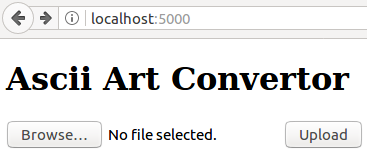
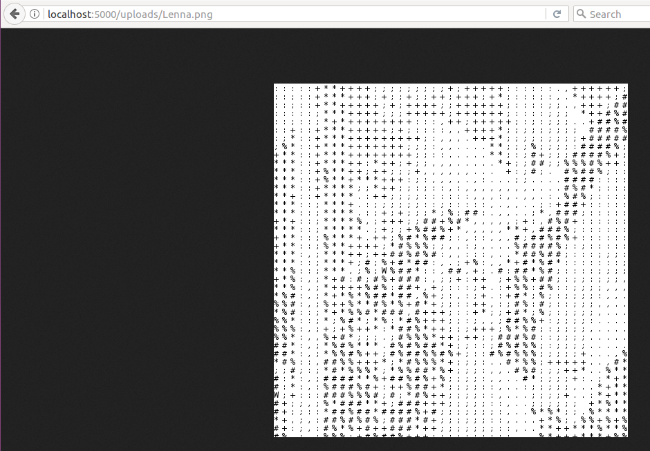

# 7. Run Ascii Art Convertor Local

## 7.1 Ascii art function {#func}
From the 5 Create Ascii Art Application, you can create an ascii art function.

You have to put an Lenna.png in the same folder as your source code and change the font location on 9th line.
```py
def aa(img):
    w, h = img.size
    pixels = img.load()
    fontsize = 12
    fontpath = 'path/to/your/font'
    # On windows, fontpath = 'C://Windows/Fonts/msgothic.ttc'
    # On Mac, fontpath = '/System/Library/Fonts/Menlo.ttc'
    # On Linux, fontpath = '/usr/share/fonts/truetype/dejavu/DejaVuSansMono.ttf'
    font = ImageFont.truetype(fontpath, fontsize, encoding='utf-8')
    output_img = Image.new(mode='RGBA', size=(w,h), color=(255,255,255))
    draw = ImageDraw.Draw(output_img)
    for y in range(0, h, fontsize): # The third parameter in range is a step 
        for x in range(0, w, fontsize):
            r, g, b = pixels[x, y]
            gray = r * 0.2326 + g * 0.7152 + b * 0.0722
            if gray  > 225:
                character = ' '
            elif gray > 200:
                character = '.'
            elif gray > 175:
                character = ','
            elif gray > 150:
                character = ':'
            elif gray > 125:
                character = ';'
            elif gray > 100:
                character = '+'
            elif gray > 75:
                character = '*'
            elif gray > 50:
                character = '%'
            elif gray > 25:
                character = '#'
            else:
                character = 'W'
            draw.text((x, y), character, font=font, fill = '#000000')
            # #000000 corresponds black
    return output_img

img = Image.open('Lenna.png').convert('RGB')
output = aa(img)
output.save('output.png')
```


## 7.2 Full code {#full}

Now you join the flask code and aa code. Use ```aa``` function in flask code. Change upload folder location and font localtion.

```py
import os
from flask import Flask, request, redirect, url_for, send_from_directory, flash
from werkzeug.utils import secure_filename
from PIL import Image, ImageFont, ImageDraw
# import BytesIO to load image from uploaded file without saving
from io import BytesIO

UPLOAD_FOLDER = '/path/to/the/uploads' # 'uploads' when you did mkdir uploads.
# Allow only image files
ALLOWED_EXTENSIONS = set(['png', 'jpg', 'jpeg', 'gif'])

app = Flask(__name__)
app.config['UPLOAD_FOLDER'] = UPLOAD_FOLDER

def aa(img):
    w, h = img.size
    pixels = img.load()
    fontsize = 12
    fontpath = 'path/to/your/font'
    # On windows, fontpath = 'C://Windows/Fonts/msgothic.ttc'
    # On Mac, fontpath = '/System/Library/Fonts/Menlo.ttc'
    # On Linux, fontpath = '/usr/share/fonts/truetype/dejavu/DejaVuSansMono.ttf'
    font = ImageFont.truetype(fontpath, fontsize, encoding='utf-8')
    output_img = Image.new(mode='RGBA', size=(w,h), color=(255,255,255))
    draw = ImageDraw.Draw(output_img)
    for y in range(0, h, fontsize): # The third parameter in range is a step 
        for x in range(0, w, fontsize):
            r, g, b = pixels[x, y]
            gray = r * 0.2326 + g * 0.7152 + b * 0.0722
            if gray  > 225:
                character = ' '
            elif gray > 200:
                character = '.'
            elif gray > 175:
                character = ','
            elif gray > 150:
                character = ':'
            elif gray > 125:
                character = ';'
            elif gray > 100:
                character = '+'
            elif gray > 75:
                character = '*'
            elif gray > 50:
                character = '%'
            elif gray > 25:
                character = '#'
            else:
                character = 'W'
            draw.text((x, y), character, font=font, fill = '#000000')
            # #000000 corresponds black
    return output_img

def allowed_file(filename):
    return '.' in filename and \
           filename.rsplit('.', 1)[1].lower() in ALLOWED_EXTENSIONS

@app.route('/', methods=['GET', 'POST'])
def upload_file():
    if request.method == 'POST':
        # check if the post request has the file part
        if 'file' not in request.files:
            flash('No file part')
            return redirect(request.url)
        file = request.files['file']
        # if user does not select file, browser also
        # submit a empty part without filename
        if file.filename == '':
            flash('No selected file')
            return redirect(request.url)
        if file and allowed_file(file.filename):
            filename = secure_filename(file.filename)
            # load file from uploads.
            img = Image.open(BytesIO(file.read()))
            output = aa(img)
            output.save(os.path.join(app.config['UPLOAD_FOLDER'], filename))
            return redirect(url_for('uploaded_file',
                                    filename=filename))
    # Change a title and heading
    return '''
    <!doctype html>
    <title>Ascii Art Convertor</title>
    <h1>Ascii Art Convertor</h1>
    <form method=post enctype=multipart/form-data>
      <p><input type=file name=file>
         <input type=submit value=Upload>
    </form>
    '''

@app.route('/uploads/<filename>')
def uploaded_file(filename):
    return send_from_directory(app.config['UPLOAD_FOLDER'],
                               filename)
app.run()
```

The top page is



Upload an image and then you are redirected to


