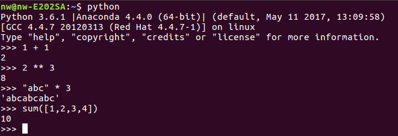

# 3. Some Basic Grammar

## 3.1 Three principles {#three-principles}
No matter which programming language you choose,

- Code runs from the first line.
- You can diverge a code by if...else.
- You can make a loop to loop.

## 3.2 Arithmatic {#arithmatic}
Run python from command line and execute some calculations. A part after # is ignored by Python. So I put an output.

```py
1 + 1 # 2
2 ** 3 # 8
10 % 3 # 1
"abc" * 3 # "abcabcabc"
sum([1,2,3,4]) # 10
```



## 3.3 Type {#type}
Every variable has type. Computer handles an integer and a decimal differently. We will see what they are in the following.

```py
type(1) # int
type(1.) # float
type("1") # str
type([1,2,3]) # list
type((1,)) # tuple
type({"a":1}) # dict
```

What if you add int to str?

```py
1 + "Hi"
```

it throws an error.

What if you add int to float?


```py
1 + 0.1
```

it works. Integer is automatically converted into float.

## 3.4 Loop {#loop}
Try following code


```py
for i in range(10):
    print(i)
```

You can iterate from 0 to 9. Indentation is needed in Python. Some people prefer tab and others spaces.

How about this code?

```py
x = ['a',9,100.1]
for i in x:
    print(i)
```
You have just iterated in a list. "=" means substitution in programming. It does not mean "equal" in math. In this and previous examples, ```i``` is dummy. So the following code shows the same result.

```py
for j in x:
    print(j)
```

You can also make a condition to breaka loop

```py
a = 0
while a < 10:
    print(a)
    a += 1
```

This is the same as the example with ```for i in range(10):```. ```a += 1``` means incrementation, ```a += 1```.

## 3.5 if...else {#if-else}
Try following code. You can diverge code.

```py
for i in range(10):
    if i > 5:
        print(i)
```

also, you can add else

```py
for i in range(10):
    if i > 5:
        print(i)
    else:
        print(i, 'is less than six')
```

You can diverge as you want by adding elif clause. It comes from "else if".

```py
for i in range(10):
    if i > 5:
        print(i)
    elif i > 0:
        print('i is positive')
    else:
        print('i is zero')
```

## 3.6 int and float {#int-and-float}
int is integer. float is decimal. 

You can divide a number.

```py
x = 10
y = 3
print(x / y) # gives you float 3.33333...
print(x // y) # gives int 3
print(x % y) # gives int 1
```

you can convert float into int

```py
x = 2.6
y = int(x)
print(y) # 2
```

## 3.7 str {#str}
String is not a thread. It consists from characters. Either single and double quote are allowed.

```py
s = 'Hi, human'
print(s)
```

You can embed variable in a string.

```py
x = 'dog'
s = 'HI, {}'.format(x)
print(s)
```

You can join strings.

```py
x = 'Hi,'
y = ' cat'
z = x + y
print(z) # 'Hi, cat'
```

You can contain single quote in a string quoted by double quotes and vice vaca.

```py
x = "I've been there"
y = 'He said, "I go."'
print(x)
print(y)
```

When you want to use single quote in a string single quoted, escape with \.

```py
s = 'I\'ve gone'
```

you can slice a string.

```py
x = 'abcde'
s = x[0:2] # 'ab'
s = x[1:3] # 'bc'
s = x[2:] # 'cde'
```

You can iterate a string

```py
>>>for i in 'orange':
...    print(i)
...
o
r
a
n
g
e
```

## 3.8 list {#list}
List is nice when you want to put many values.
```py
x = 'Hi!'
a = [1,2,"a",x]
for i in a:
    print(a)
```

To get data from a list, be careful the index starts from zero.
```py
a = ['a', 'b', 'c']
a[0] # 'a'
a[1] # 'b'
a[2] # 'c'
a[-1] # 'c'
a[0:2] # ['a', 'b']
```

list.pop deletes an element from a list and returns the element.

```py
x = a.pop() # 'c'
print(a) # ['a', 'b']
y = a.pop(0) # 'a'
print(a) # ['b']
```

You can add an element to an existing list.

```py
a = []
a.append(1)
print(a) # [1]
a.append('123')
print(a) # [1, '123']
```

You can judge something is in a list.

```py
2 in [1, 2, 3] # true
```

Also, you can get an index of an element. When an element is not found in the list, it throws an error.

```py
x = [1,2,3]
x.index(2) # 1
x.index(0) # ValueError
```

Now you can calculate a sum of 1 to 100

```py
s = 0
for i in range(101):
    s = s + i
print(s)
```
or

```py                                                                                        
s = 0
for i in range(101):
    s += s + i 
print(s)
```

## 3.9 tuple {#tuple}
Think tuple is length unchangeable list.

```py
t = (1,2,3)
x = t[0]
```

## 3.10 dict {#dict}
In list and tuple, order matters. In dict, order does not matter. It makes pairs of key:value.

```py
d = {'a': 0, 'b': 1, 'c':[-1,-2]}
d['d'] = 'new key'
d[0] = 0
d['a'] # 0
```

## 3.11 function {#function}
if you want to use some code repeatedly, you can make a function.

```py
x = []
y = []
for i in range(100):
    x.append(i)
    y.append(func(i))
def func(x):
    return x**2
```

when you are on interactive mode,

```py
def func(x):
    return x**2

x = []
y = []
for i in range(100):
    x.append(i)
    y.append(func(i))
print(x)
print(y)
```
