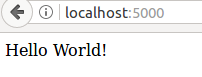

# 6. Publish Web Application
First, We start to learn how to create the most simple web application, and then we make an application, ascii art converter, then finally publish it.

## 6.1 What happens when you browse a website? {#client-server}

Browser (client) asks a web server, then the server responses a content. To build a web application or make a website, you set up a server.


## 6.2 We use web frame work, Flask {#flask}
Web frame work helps you to create an web application easily. There are many web frame work. This lecture uses flask, as it is so simple and minimum.

We can say, dijango is to Ruby-on-rails what flask is to sinatra.

## 6.3 Minimal application: Just say "Hello World!" {#hello}
A discussion below is based on 
[http://flask.pocoo.org/docs/0.12/quickstart/](http://flask.pocoo.org/docs/0.12/quickstart/)

We launch a server and show just 'Hello World'.

sample.py
```py
from flask import Flask
app = FLask(__name__)
@app.route('/')
def hello():
    return 'Hello World!'
app.run()
```

execute ```python sample.py```.
Now head over to [http://localhost:5000](http://localhost:5000), and you should see your hello world greeting.




## 6.4 Change URL (Rooting) {#rooting}

route function is used to bind a url and a function. Here are basic examples.

```py
from flask import Flask
app = Flask(__name__)

@app.route('/')
def index():
    return 'Index page'

@app.route('/hello')
def hello():
    return 'Hello world!'

app.run()
```

Visit  
http://localhost:5000  
http://localhost:5000/hello


Also, You can put a variable in a URL as ```<variable_name>```. It can be used as a keyword argument to your function.


```py
from flask import Flask

app = Flask(__name__)

@app.route('/user/<username>')
def show_user_profile(username):
    # show the user profile for that user
    return 'User {}'.format(username)

@app.route('/post/<int:post_id>')
def show_post(post_id):
    # show the post with the given id, the id is an integer
    return 'Post {}'.format(post_id)

app.run()
```

## 6.5 URL Building {#building}

You can get URL from function by url_for.

```py
from flask import Flask, url_for

app = Flask(__name__)
@app.route('/')
def index(): pass

@app.route('/login')
def login(): pass
@app.route('/user/<username>')
def profile(username): pass
with app.test_request_context():
    print(url_for('index'))
    print(url_for('login'))
    print(url_for('login', next='/'))
    print(url_for('profile', username='John Doe'))
```

It shows
```
/
/login
/login?next=/
/user/John%20Doe
```

## 6.6 Simple GET and POST {#get-and-post}
How do you send your name and email address to a website? It uses input format. When you just see a page, method is called GET, and when you upload something, method is called POST.

```py
from flask import Flask, request

app = Flask(__name__)

@app.route('/', methods=['GET', 'POST'])
def form():
    if request.method == 'POST':
        name = request.form['yourname']
        return 'Welcome {}'.format(name)
    return '''<form action ="/" method="POST">
    Name <input type="text" name=yourname>
    <input type="submit" value="Submit"></form>'''
app.run()
```

  


## 6.7 Create Uploader {#uploader}
This section is based on  
[http://flask.pocoo.org/docs/0.12/patterns/fileuploads/](http://flask.pocoo.org/docs/0.12/patterns/fileuploads/)

We prepare an uploader. 
You have to make uploader folder from source file like followings:  
```$ mkdir uploads```  
and replace 5th line with  
```UPLOAD_FOLDER = 'uploads'```.

```py
import os
from flask import Flask, request, redirect, url_for, send_from_directory, flash
from werkzeug.utils import secure_filename

UPLOAD_FOLDER = '/path/to/the/uploads' # 'uploads' when you follow the above.
ALLOWED_EXTENSIONS = set(['txt', 'pdf', 'png', 'jpg', 'jpeg', 'gif'])

app = Flask(__name__)
app.config['UPLOAD_FOLDER'] = UPLOAD_FOLDER

def allowed_file(filename):
    return '.' in filename and \
           filename.rsplit('.', 1)[1].lower() in ALLOWED_EXTENSIONS

@app.route('/', methods=['GET', 'POST'])
def upload_file():
    if request.method == 'POST':
        # check if the post request has the file part
        if 'file' not in request.files:
            flash('No file part')
            return redirect(request.url)
        file = request.files['file']
        # if user does not select file, browser also
        # submit a empty part without filename
        if file.filename == '':
            flash('No selected file')
            return redirect(request.url)
        if file and allowed_file(file.filename):
            filename = secure_filename(file.filename)
            file.save(os.path.join(app.config['UPLOAD_FOLDER'], filename))
            return redirect(url_for('uploaded_file',
                                    filename=filename))
    return '''
    <!doctype html>
    <title>Upload new File</title>
    <h1>Upload new File</h1>
    <form method=post enctype=multipart/form-data>
      <p><input type=file name=file>
         <input type=submit value=Upload>
    </form>
    '''

@app.route('/uploads/<filename>')
def uploaded_file(filename):
    return send_from_directory(app.config['UPLOAD_FOLDER'],
                               filename)
app.run()
```


