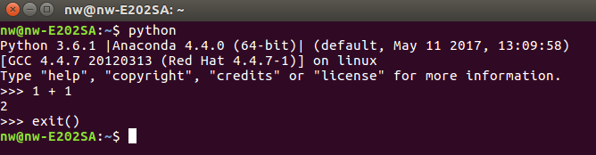
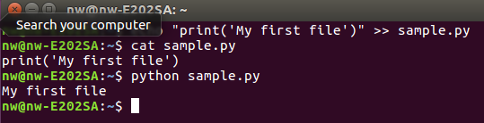

# 2. Launch Python
After installing Python, now you are ready to run Python.

## 2.1 From Terminal {#from-terminal}
Open terminal (Mac, Linux) or Command prompt (Windows). type "Python". To exit, ctrl + C or type exit().

:wq
## 2.2 From File {#from-file}
Create a file ```sample.py``` with following content.

```py
print('My first file')
```

 If you are on Linux, you can execute 

```
echo "print('My first file')" >> sample.py
```

. then, run 

```
python sample.py
```
.


