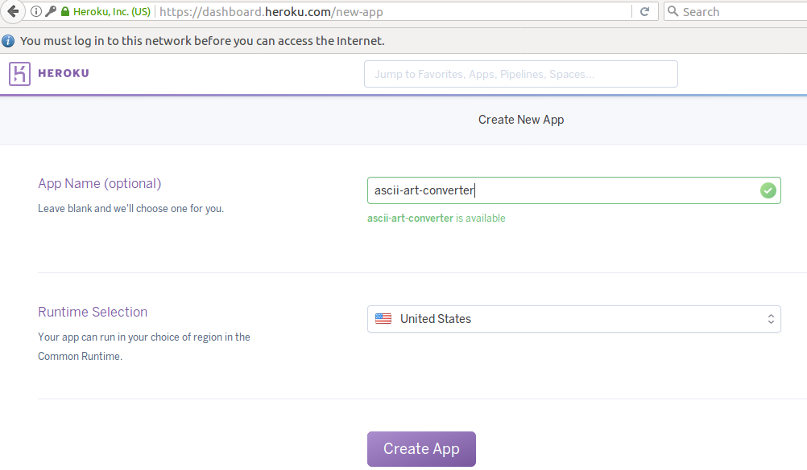
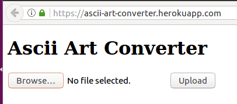
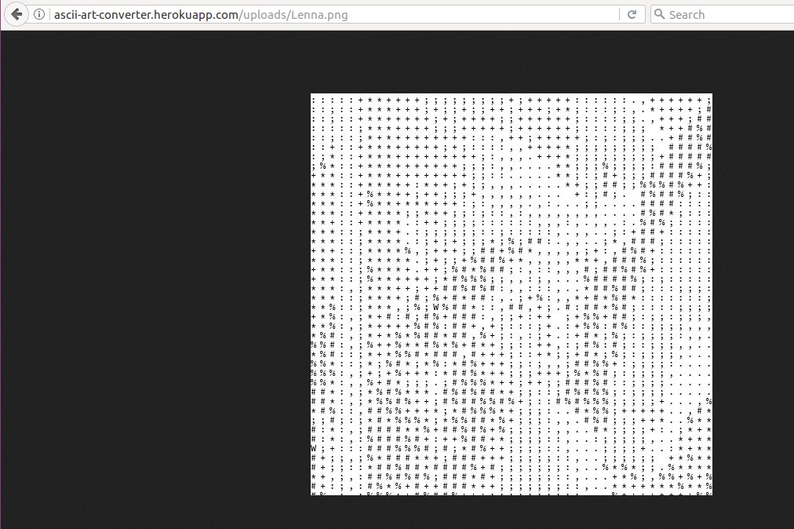

# 8 Publish
# 8.1 Register Heroku {#register}
Go to  
https://www.heroku.com/  
and sign up, then choose Python.


Create a new application on Heroku.




## 8.2 Prepare files {#prepare}

### Make a deploy direcory
Make a deploy directory and go into there
```
$ mkdir aa
$ cd aa
```

### runtime.txt
Write python version in runtime.txt.
```$ echo python-3.6.0 > runtime.txt```

### requirements.txt
Write dependencies to requirements.txt.

If you are not on Anaconda,

```$ pip freeze > requirements.txt```

If you are on Anaconda, choose ones you installed.

requirements.txt should contain:
```
gunicorn==19.1.0
Flask==0.12.2
Pillow==4.1.1
Werkzeug==0.12.2
```

### Procfile
Write how to launch application in Procfile

```$ echo web: gunicorn myapp:app --log-file=- > Procfile```

Heroku's requirements are done.

### Download font file
Download Source Code Pro, a monospaced free font by Adobe.

https://github.com/adobe-fonts/source-code-pro

Unzip, and move 

source-code-pro-2.030R-ro-1.050R-it/TTF/SourceCodePro-Regular.ttf

to aa folder.

### Create an upload directory
Create an upload directory and empty README.md in it because you are not allowed to ```git add``` an empty folder.

```
$ mkdir uploads
$ echo > uploads/README.md
```

### myapp.py
Create a myapp.py with fontpath and UPLOAD_FOLDER modified appropriately.

```
UPLOAD_FOLDER = 'uploads'
fontpath = 'SourceCodePro-Regular.ttf'
```


Also, do not forget to encapsulate app.run() at last.

```
if __name__ == '__main__':
    app.run()
```

myapp.py

```py
import os
from flask import Flask, request, redirect, url_for, send_from_directory, flash
from werkzeug.utils import secure_filename
from PIL import Image, ImageFont, ImageDraw
# import BytesIO to load image from uploaded file without saving
from io import BytesIO

UPLOAD_FOLDER = 'uploads'
# Allow only image files
ALLOWED_EXTENSIONS = set(['png', 'jpg', 'jpeg', 'gif'])

app = Flask(__name__)
app.config['UPLOAD_FOLDER'] = UPLOAD_FOLDER

def aa(img):
    w, h = img.size
    pixels = img.load()
    fontsize = 12
    fontpath = 'SourceCodePro-Regular.ttf'
    # On windows, fontpath = 'C://Windows/Fonts/msgothic.ttc'
    # On Mac, fontpath = '/System/Library/Fonts/Menlo.ttc'
    # On Linux, fontpath = '/usr/share/fonts/truetype/dejavu/DejaVuSansMono.ttf'
    font = ImageFont.truetype(fontpath, fontsize, encoding='utf-8')
    output_img = Image.new(mode='RGBA', size=(w,h), color=(255,255,255))
    draw = ImageDraw.Draw(output_img)
    for y in range(0, h, fontsize): # The third parameter in range is a step 
        for x in range(0, w, fontsize):
            r, g, b = pixels[x, y]
            gray = r * 0.2326 + g * 0.7152 + b * 0.0722
            if gray  > 225:
                character = ' '
            elif gray > 200:
                character = '.'
            elif gray > 175:
                character = ','
            elif gray > 150:
                character = ':'
            elif gray > 125:
                character = ';'
            elif gray > 100:
                character = '+'
            elif gray > 75:
                character = '*'
            elif gray > 50:
                character = '%'
            elif gray > 25:
                character = '#'
            else:
                character = 'W'
            draw.text((x, y), character, font=font, fill = '#000000')
            # #000000 corresponds black
    return output_img

def allowed_file(filename):
    return '.' in filename and \
           filename.rsplit('.', 1)[1].lower() in ALLOWED_EXTENSIONS

@app.route('/', methods=['GET', 'POST'])
def upload_file():
    if request.method == 'POST':
        # check if the post request has the file part
        if 'file' not in request.files:
            flash('No file part')
            return redirect(request.url)
        file = request.files['file']
        # if user does not select file, browser also
        # submit a empty part without filename
        if file.filename == '':
            flash('No selected file')
            return redirect(request.url)
        if file and allowed_file(file.filename):
            filename = secure_filename(file.filename)
            # load file from uploads.
            img = Image.open(BytesIO(file.read()))
            output = aa(img)
            output.save(os.path.join(app.config['UPLOAD_FOLDER'], filename))
            return redirect(url_for('uploaded_file',
                                    filename=filename))
    # Change a title and heading
    return '''
    <!doctype html>
    <title>Ascii Art Converter</title>
    <h1>Ascii Art Converter</h1>
    <form method=post enctype=multipart/form-data>
      <p><input type=file name=file>
         <input type=submit value=Upload>
    </form>
    '''

@app.route('/uploads/<filename>')
def uploaded_file(filename):
    return send_from_directory(app.config['UPLOAD_FOLDER'],
                               filename)
if __name__ == '__main__':
    app.run()
```

### Check files and a directory
Now, aa folder has following structure

```
aa
├── myapp.py
├── Procfile
├── requirements.txt
├── runtime.txt
├── SourceCodePro-Regular.ttf
└── uploads
    └── README.md


```

## 8.3 Deploy to Heroku {#deploy}
Deployment follows Heroku official guide for Flask

https://devcenter.heroku.com/articles/getting-started-with-python#set-up

.

Install Heroku CLI to upload files to Heroku.
You can get CLI from 

https://devcenter.heroku.com/articles/heroku-cli  

. Launch Terminal (Linux or Mac) or Command Prompt (Windows) and go to source code directory, aa.

Login to heroku with your email address and password

```
$ heroku login
```

Create a git repository. Replace with your application name.

```
$ git init
$ heroku git:remote -a <your_app_name>
```

Deploy your application

```
$ git add .
$ git commit -m "initial commit"
$ git push heroku master
```



After uploaded an image,



Bravo!
